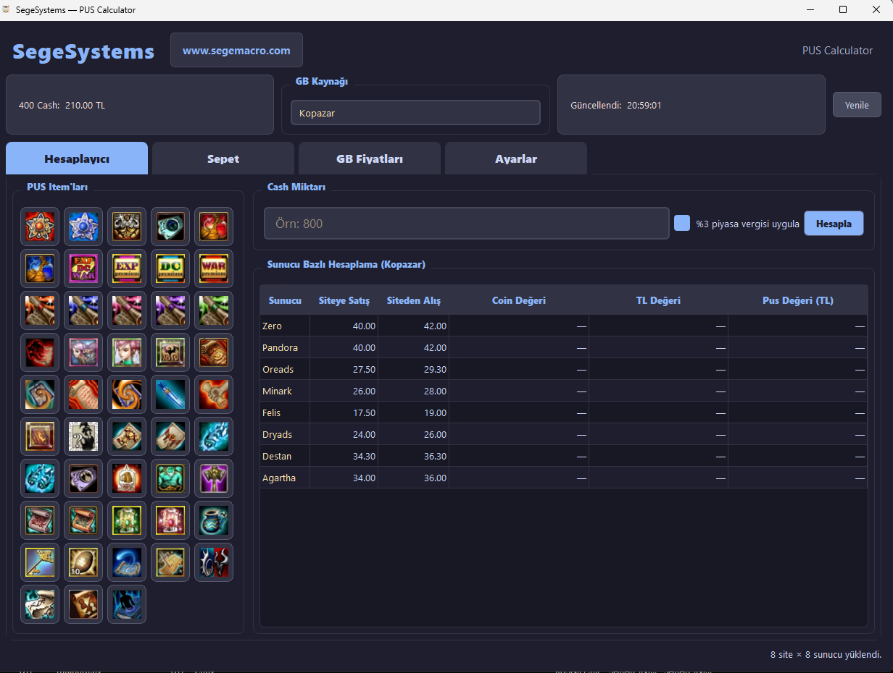

# PUS Hesaplıyıcı v2

> Knight Online PUS / Cash → Coin / TL hesaplayıcı. 8 satıcı sitesinin fiyatlarını otomatik çeker, tüm sunucularda karşılaştırır.

**SegeSystems** · [www.segemacro.com](https://www.segemacro.com)



---

## Özellikler

- **48 PUS item** için tek tıkla otomatik cash girişi
- **8 satıcı sitesi** karşılaştırması: SonTeklif, Bynogame, Kopazar, OyunEks, Gamesatis, OyunFor, BursaGB, Klasgame
- **8 sunucu** desteği: Zero, Felis, Agartha, Pandora, Dryads, Destan, Minark, Oreads
- **Sepet**: birden çok item için toplam değer + sunucu başına coin
- **Ayarlar sekmesi**: istemediğin sunucuları gizle
- **%3 piyasa vergisi** açma/kapama
- Modern dark tema (Catppuccin esinli)
- Arkaplan thread ile fiyat çekimi — UI kilitlenmez
- Ayarlar `%APPDATA%/SegeSystems_PUS/settings.json` altına kalıcı kaydedilir

---

## Sekmeler

| Sekme | Ne Yapar |
|-------|----------|
| **Hesaplayıcı** | Cash → seçili sunucuda coin / TL / Pus değeri |
| **Sepet** | Çoklu item toplam değer + sunucu başına toplam coin |
| **GB Fiyatları** | 8 site × 8 sunucu fiyat matrisi (enucuzgb tarzı) |
| **Ayarlar** | Sunucu görünürlüğü filtresi |

---

## İndirme

> ⚠️ EXE 27 MB olduğu için GitHub'ın repo dosya boyut limitini (25 MB) aşıyor. [**Releases**](https://github.com/SegeSystems/PUS-HESAPLIYICI/releases) sekmesinden indir.

Çift tıklayarak çalışır, kurulum gerekmez.

---

## Kullanım

1. `SegeSystems_PUS.exe`'yi indir, istediğin yere koy
2. Çift tıkla — fiyatlar otomatik çekilir
3. Sol panelden bir PUS itemı seç → cash otomatik girilir, hesap görünür
4. **GB Kaynağı** combobox'tan farklı satıcıyı seç → tablo anında güncellenir
5. **Yenile** butonu fiyatları yeniden çeker

---

## Kaynak Koddan Çalıştırma

Python 3.8+:

```bash
pip install PyQt5 requests beautifulsoup4
python PUS_v2.py
```

---

## Nuitka ile Derleme

```bash
pip install nuitka

python -m nuitka --onefile --enable-plugin=pyqt5 ^
  --include-data-dir=icons=icons ^
  --include-data-files=sege.ico=sege.ico ^
  --windows-icon-from-ico=sege.ico ^
  --windows-console-mode=disable ^
  --assume-yes-for-downloads ^
  --output-filename=SegeSystems_PUS.exe ^
  PUS_v2.py
```

Çıktı: `dist/SegeSystems_PUS.exe`

---

## Veri Kaynakları

- **Cash fiyatı**: [kopazar.com/knight-online-cash](https://www.kopazar.com/knight-online-cash) (400 cash bundle TL)
- **GB fiyatları**: [enucuzgb.com](https://www.enucuzgb.com) (8 site agregası, tek istekte gelir)

Cloudflare cookie challenge'ı otomatik bypass edilir, kullanıcı tarafında bir işlem gerekmez.

---

## Bağımlılıklar

- Python 3.8+
- PyQt5
- requests
- beautifulsoup4

---

## İletişim & Katkı

- **Web**: [www.segemacro.com](https://www.segemacro.com)
- **GitHub**: [SegeSystems/PUS-HESAPLIYICI](https://github.com/SegeSystems/PUS-HESAPLIYICI)
- **Issues**: Bug bildirimi / öneri için [Issues](https://github.com/SegeSystems/PUS-HESAPLIYICI/issues)

Pull request'ler açıktır.

---

## Lisans

MIT — özgürce kullanın, fork'layın, geliştirin.

---

> Knight Online ücretsiz oynanır. Bu araç bir piyasa takip aracıdır; listelenen satış sitelerinin hiçbiri ile resmi bağlantısı yoktur. Fiyatlar doğrudan o sitelerin halka açık sayfalarından okunur.
